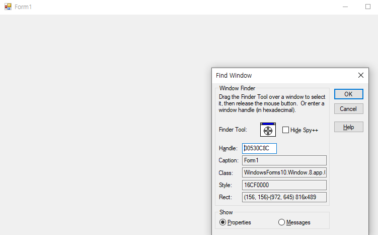
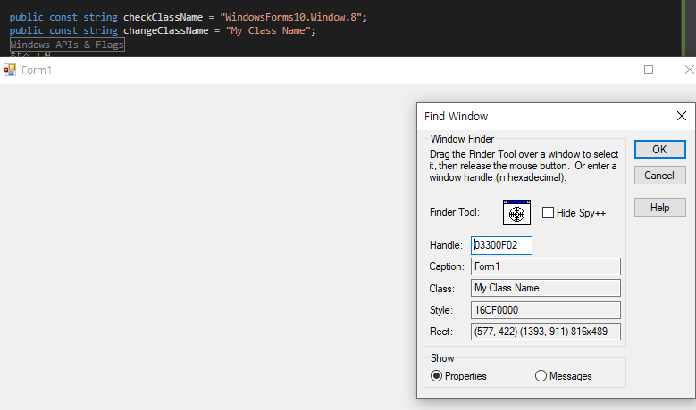

# changeClassName

C# Change Default ClassName

 * TEST : Windows10 21H1 (OS Build 19043.985)
 * Net Framework Version 4.7.2
 * ntdll Version : 10.0.19041.964
 * user32 Version : 10.0.19041.906






# Using
Insert that code at the beginning of the Program.cs Main function.


```
changeClassName.ClassName.Change();
```

